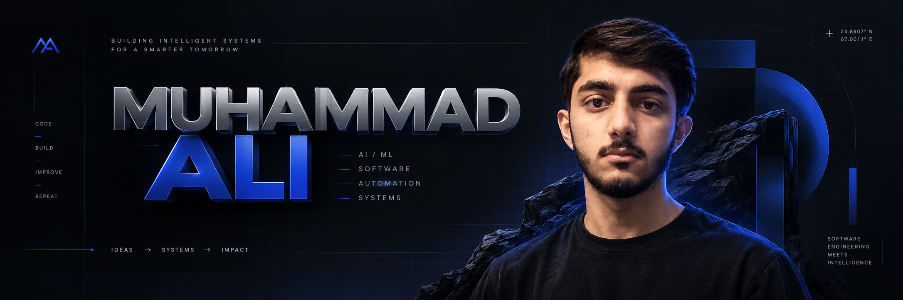

 

# Muhammad Ali

### AI/ML Engineer · Software Developer · Automation Builder

Building intelligent systems, practical software, and automated workflows.

<a href="YOUR_PORTFOLIO_URL">Portfolio</a>
&nbsp;·&nbsp;
<a href="YOUR_LINKEDIN_URL">LinkedIn</a>
&nbsp;·&nbsp;
<a href="mailto:YOUR_EMAIL">Email</a>

---

## About

I build intelligent software systems that connect **AI/ML, software
engineering, and automation** to solve practical problems.

My work spans machine learning, full-stack development, backend systems,
and AI-powered workflows. I enjoy taking an idea from concept to a
working system — understanding the problem, designing the architecture,
and building something useful.

Currently focused on developing deeper expertise in **machine learning
engineering, AI agents, and the systems required to move ML applications
from development into production**.

---

## What I Build

<table>
<tr>
<td width="33%" valign="top">

### AI / ML

Machine learning, AI-powered applications, and intelligent systems.

</td>
<td width="33%" valign="top">

### Software

Full-stack applications, backend systems, APIs, and databases.

</td>
<td width="33%" valign="top">

### Automation

AI agents, n8n workflows, and practical API integrations.

</td>
</tr>
</table>

---

## Featured Projects

### Business Inventory Management System

A hybrid inventory management system designed to manage products,
orders, and inventory operations through a centralized application.

Built with a React frontend, ASP.NET Core backend, and PostgreSQL
database.

`React` `C#` `ASP.NET Core` `PostgreSQL` `Supabase`

---

### AI Automation & Agent Workflows

AI-powered automation workflows that connect services, process
information, and reduce repetitive manual work.

Exploring how intelligent agents and workflow automation can be
combined to create practical business systems.

`n8n` `AI Agents` `APIs` `Automation`

---

### AI-Powered SRS Generation System

A software project focused on generating structured Software
Requirements Specifications using AI.

The system combines a web application, backend services, and
AI-powered generation to turn project information into organized
software documentation.

`Node.js` `Express` `Hugging Face` `SQLite` `JavaScript`

---

### Interactive Digital Experiences

Exploring the intersection of software engineering, interactive
design, and digital experiences through experimental web projects.

`React` `Next.js` `JavaScript` `GSAP` `Motion`

---

## Tech Stack

**Languages**

`Python` `C#` `Java` `JavaScript` `SQL`

**AI / ML**

`Machine Learning` `AI Agents` `Hugging Face`

**Software**

`React` `Node.js` `ASP.NET Core` `REST APIs`

**Automation**

`n8n` `Workflow Automation` `API Integration`

**Databases**

`PostgreSQL` `Supabase` `SQLite`

**Tools**

`Git` `GitHub` `Docker`

---

## Current Direction

Working toward becoming an **AI/ML Engineer**, with a long-term focus
on building reliable ML systems and understanding the engineering
required to move models from development into production.

Interested in the intersection of **machine learning, software
engineering, and MLOps**.

---

## Connect

🌐 Portfolio: **Your Portfolio]](https://space-ship-lemon.vercel.app/**

💼 LinkedIn: **https://www.linkedin.com/in/muhammad-ali-508378259/**

📧 Email: **alisumair2006@gmail.com**

---

### Build → Learn → Improve

